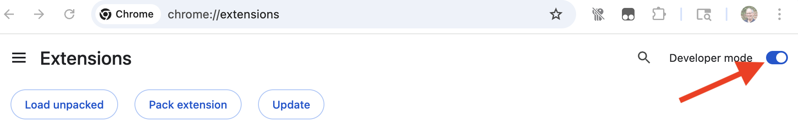
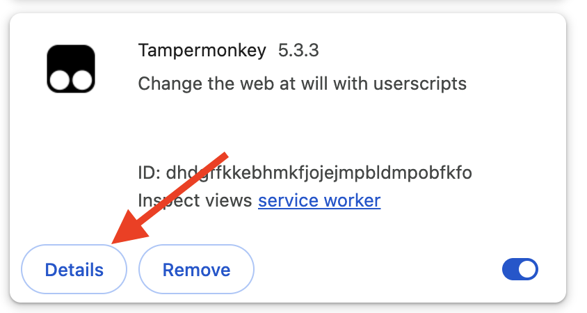
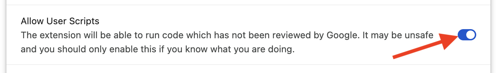
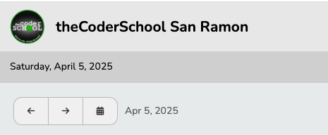
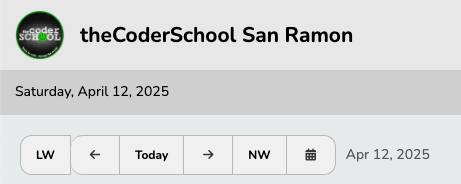
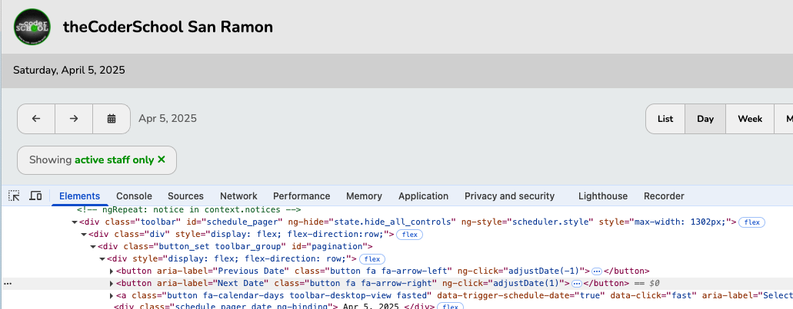

# pike13
 Tampermonkey script and other utilities for Pike13


## Setup


### Install the Tampermonkey extension in Chrome

- Go to the [Chrome Web Store - Extensions](https://chromewebstore.google.com/category/extensions?utm_source=ext_sidebar&hl=en-US)
- Search for "Tampermonkey" and go to the Tampermonkey page
- Click the "Add to Chrome" button

### Grant Permissions in Chrome

- Go to Chrome Extensions
    - in Settings, click on "Extensions" (or go to chrome://extensions/ )
- Enable "Developer mode" in Chrome extensions
    - toggle the "Developer mode" switch to "on"

    

- Allow Scripts from Tampermonkey
    - In Extensions, click on "My extensions"
    - Find the Tampermonkey extension and click on Details

    

    - Find "Allow User Scripts" and toggle to "on"

    

For more information regarding Tampermonkey permissions see https://www.tampermonkey.net/faq.php#Q209

### New Install To Add Today/NextWeek/LastWeek buttons to your Schedule Page

To install this script, you will import the file from Github into Tampermonkey.

- Click on the  Tampermonkey button and go to the dashboard
- Click on the Utilities tab
- Paste this link: https://raw.githubusercontent.com/trivalleycs/pike13/refs/heads/main/scripts/tampermonkey/add-buttons.js
 into the URL box
- Click Import
- Click install and you’re all set!


### How to Fix If Already Installed

For this fix, you will copy the contents from the file in Github into the file in Tampermonkey

- in Chrome, click on the Tampermonkey extension
- Click "Dashboard"
- Click the "Edit" button for the "Pike13+" script
- this should show the contents of the current script

- go to https://raw.githubusercontent.com/trivalleycs/pike13/refs/heads/main/scripts/tampermonkey/add-buttons.js
- select All and Copy all the content
- go back to your Pike13+ Tampermonkey script
- select All and Paste the content
- click "Save" in Tampermonkey

## Adding Last Week (LW), Today and Next Week(NW) Buttons

Pike13 provides forward and backward buttons.



The [add-buttons script](./scripts/tampermonkey/add-buttons.js) adds convenience buttons:

- LW: goes to the "Last Week"
- Today: returns you to today
- NW: goes to the "Next Week"



### NOTE - Buttons may break with Pike13 updates 
### We will do our best to update and share this fix

This code depends upon finding Pike13's forward (right) and backward (left) buttons.

```
    /*
    Note - Pike13 may change these selectors 
    resulting in the buttons disappearing w/o an error message
    */
    var back = $("#pagination > div > button.button.fa.fa-arrow-left");
    var forward = $("#pagination > div > button.button.fa.fa-arrow-right");

```    


These are found using CSS Selectors.  With a Pike13 update, these locations may change.

#### Fix: find and update the selector

In Chrome, 

- right click on the button
- select "Inspect"

This will bring up DevTools with the html highlighted



- right click on the highlighted html
- select "Copy"
- select "Copy Selector"

Then, you can past this value into the code

```
    var forward = $("PASTE-THE-SELECTOR-HERE");
```
